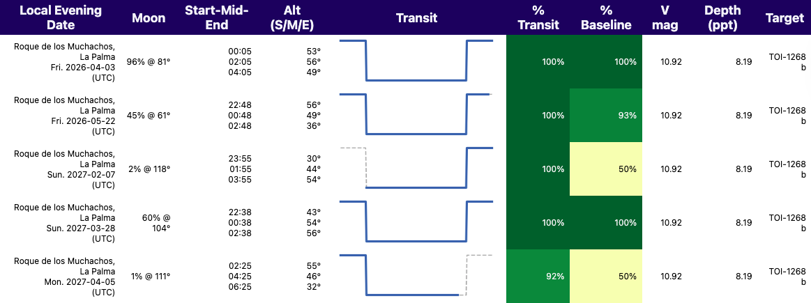
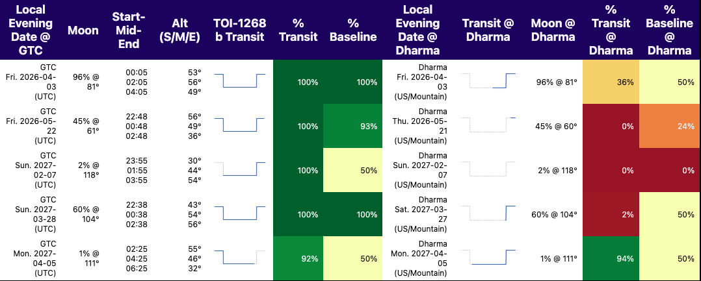

# Transit Planner 

A Python toolkit for planning and visualizing exoplanet transit observations from ground-based observatories.

## Overview

`TransitPlan.py` provides comprehensive functionality for visualizing the observability of transiting exoplanet events from Earth-based observatories. The script integrates the astronomical calculations and observability constraints calculated by the [`astroplan` Open-Source Observation Planning Package in Python](https://ui.adsabs.harvard.edu/abs/2018AJ....155..128M/abstract), providing additional data visualization functions to help observers plan effective, or simultaneous, ground-based transit observations. The visualizations and information displayed for transiting events are inspired by the [TAPIR](https://astro.swarthmore.edu/~jensen/tapir.html#fn1) web interface for planning astronomical observations, but with outputs displayable in Jupyter Notebooks via html wrapped `Pandas` DataFrames. 

## Usage

`TransitPlanExample.ipynb` is a Jupyter Notebook that shows an example of creating the required inputs for the visualization using [`astroplan`](https://astroplan.readthedocs.io/en/stable/index.html).

The order of this notebook follows the tutorials for creating [`Observer`](https://astroplan.readthedocs.io/en/stable/api/astroplan.Observer.html#astroplan.Observer) objects, followed by defining customizable observational constraints using their `constraints` module. A more complete tutorial for these steps can be found on their [documentation pages](https://astroplan.readthedocs.io/en/stable/tutorials/constraints.html). The example notebook includes both a manually input observatory (Mount Lemon SkyCenter Observatory), and another generated from the list of observatories stored in astroplan (Gran Telescopio CANARIAS; GTC). 

Next parameters for all exoplanet systems are read in from the [`nasa_exoplanet_archive`](https://astroquery.readthedocs.io/en/latest/ipac/nexsci/nasa_exoplanet_archive.html#module-astroquery.ipac.nexsci.nasa_exoplanet_archive) service using [astroquery](https://astroquery.readthedocs.io/). An example target ('TOI-1268 b') is chosen to create an [`EclipsingSystem`](https://astroplan.readthedocs.io/en/stable/api/astroplan.EclipsingSystem.html#astroplan.EclipsingSystem) object, following the [Observing Transiting Exoplanets and Eclipsing Binaries tutorial](https://astroplan.readthedocs.io/en/stable/tutorials/periodic.html), using the exoplanet system parameters queried in the previous cells. 

The [`next_primary_eclipse_time`](https://astroplan.readthedocs.io/en/stable/api/astroplan.EclipsingSystem.html#astroplan.EclipsingSystem.next_primary_eclipse_time) and [`next_primary_ingress_egress_time`](https://astroplan.readthedocs.io/en/stable/api/astroplan.EclipsingSystem.html#astroplan.EclipsingSystem.next_primary_ingress_egress_time) methods are used to calculate the next 50 transits (set using keyword `n_eclipses`) which generates a `astropy` time object list of mid-transit times and a 2-D array of ingress and egress `astropy` times respectively. The eclipses times for the target planet are calculated after the set observation time, which in this example this has been set to 2026 March 1 00:00 UTC,. After creating the [FixedTarget](https://astroplan.readthedocs.io/en/stable/api/astroplan.FixedTarget.html#astroplan.FixedTarget) object for the selected example target, TOI-1268 b, we have all of the inputs required for the `TransitPlan.py` script. 

The first function demonstrated after importing `TransitPlan` is `.display_transits()`, which provides an output dataframe for the earlier specified number of transits (User defined `n_eclipses`) for a given target from a singular observatory. The parameter `plot` in this function is default set to True, which will display the html version of the pandas dataframe with the icon for each transit shown below, which is based on the design of the TAPIR [transit finder charts](https://astro.swarthmore.edu/transits/) 

`plot` can be set to `False` to return a pandas dataframe that contains the values embeded in this display. 

The argument `visibility_cut` was set to 90 in this example, to only display transits from the list of 50 that have a transit observability of 90% or higher. If this value is unspecified, the output will include a row for each transit specified by `n_eclipses`.

### _Table column descriptions_
- The **`Local Evening Date`** column displays the observatory location, as well as the local evening date of the observation and local timezone. 

- The moon illumination and separation displayed in the **`Moon`** column are calculated from the input observatory at mid-transit time for each given transit. 

- The **`Start-Mid-End`** column gives the ingress, mid-transit, and egress times (hour:minute) listed from top to bottom. The **`Alt (S/M/E)`** column list the target altitude at these times in the same order. 

- The **`Transit`** column shows a html icon of the visible portion of the target's transit as a simple box transit model. The blue line corresponds to portions of the transit and baseline that are observable based on the input constraints. 

- The **`% Transit`** column indicates the percentage of the in-transit flux (ingress through egress) that is visible from the observatory location. These are colored based on the visibility with red being low visibility to dark green being 100% visible. 

- **`% Baseline`** indicates the percentage of the out-of-transit flux that is visible from the observatory location. In the notebook example, the observation baseline was set to 1 hour for the desired time to include before and after the ingress and egress times. This baseline keyword defaults to half the input transit duration if left unspecified, similar to the TAPIR inputs. These values are also colored based on visibility percentage similar to the **`% Transit`** column. 

- The **`V mag`** column indicates the stellar V mag provided by the exoplanet archive parameters. 

- The **`Depth (ppt)`** column indicates the transit depth provided by the exoplanet archive parameters (given in relative flux) converted to parts per thousand (ppt) as displayed in the TAPIR outputs. 

- The **`Target`** column displays the target name. 

## Multi-Observatory Comparison 
The `.simultaneous_observing()` function is demonstrated next, which allows you to compare observability across multiple observatories for coordinated campaigns or simultaneous observations.

The inputs are the same as `.display_transits()` but with an additional argument for a second `Observer` object. The output table includes all but the last three columns of the `.display_transits()` output table described above. 

After the **`% Baseline`** column, some of the parameters are shown to display the visibility from the second observer. The column names are the same but differentiated with **`@observatory_2.name`** as shown in the example below comparing GTC at Roque de los Muchachos, La Palma, and the Dharma Endownment Foundation Telescope at the Mount Lemon SkyCenter Observatory:

An important note here is that the `visibility_cut` argument (still set to 90 in this example)  will be defined based on the in-transit visibility percentage from observatory 1.

<!-- "Moon"  -->

## Dependencies

- `astroplan`: Observatory definitions and constraint evaluation
- `astropy`: Time handling, coordinates, units
- `astroquery`: NASA Exoplanet Archive access
- `pandas`: Data organization and presentation
- `matplotlib`: Plotting and visualization
- `numpy`: Numerical calculations

## Use Cases

- Planning observation schedules for transit follow-up programs
- Evaluating feasibility of transit observations from specific sites
- Coordinating multi-site simultaneous observations
<!-- - Assessing moon impact on photometric precision -->
<!-- - Generating observation reports and planning documents -->

## Attribution
These functions rely almost entirely on the astroplan package, and thus we recommend citing [Morris et al. 2018](https://ui.adsabs.harvard.edu/abs/2018AJ....155..128M/abstract) if you use this for any of your work as requested on their documentation page. 
